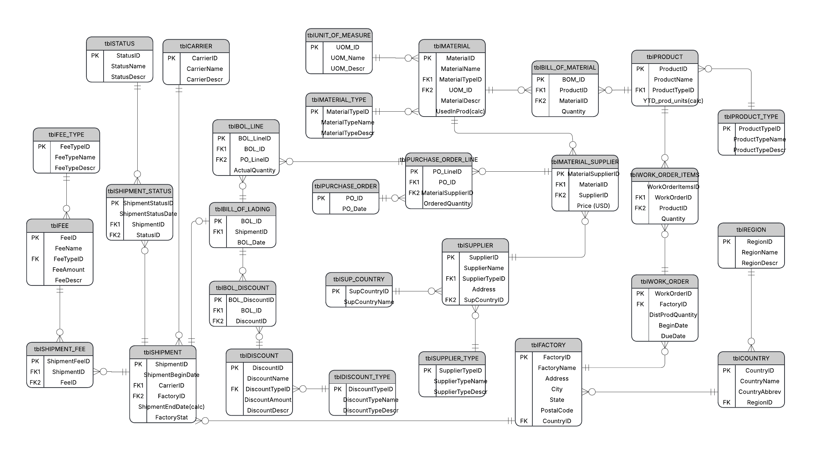

# Nike Supply Chain Database

A relational database modelling the inbound side of a footwear and apparel supply
chain: suppliers and materials, purchase orders, shipments and their status history,
bills of lading, and factory work orders.

Built on Microsoft SQL Server (T-SQL), developed in SSMS 22. Factory data comes from
Nike's public manufacturing map; all transactional data is generated synthetically.



---

## What's in it

**29 tables** across four layers:

| Layer | Count | Examples |
|---|---|---|
| Reference | 9 | `tblSTATUS`, `tblMATERIAL_TYPE`, `tblUNIT_OF_MEASURE`, `tblREGION` |
| Master | 8 | `tblSUPPLIER`, `tblMATERIAL`, `tblFACTORY`, `tblCARRIER` |
| Bridge | 4 | `tblMATERIAL_SUPPLIER`, `tblBILL_OF_MATERIAL`, `tblSHIPMENT_FEE` |
| Transactional | 8 | `tblPURCHASE_ORDER`, `tblSHIPMENT`, `tblBILL_OF_LADING`, `tblWORK_ORDER` |

Beyond the schema itself, the project covers:

- **Insert procedures with name-to-ID resolution.** Master data is loaded by name,
  not by foreign key. Each procedure calls a nested procedure to look the ID up,
  raises a custom error (`THROW 55667`) when the lookup returns NULL, and wraps the
  insert in a transaction. This keeps the ~780 seed statements readable — they pass
  `'Fabric Mill'`, not `SupplierTypeID = 6`.
- **Computed columns backed by scalar functions.** `ShipmentEndDate` derives the
  delivery date from the shipment's status history; `UsedInProd` counts how many
  products a material appears in; `YTD_prod_units` counts year-to-date production.
- **Cursor-driven data generation.** ~7,500 purchase orders and every dependent
  record — shipments, status chains, bills of lading, work orders, fees and
  discounts — generated so that each order keeps a coherent history end to end.
- **Analytical queries** over the populated database: regional delivery
  performance, carrier comparison, and purchasing value by material type.

---

## Two ways to read this
The repository ships the same code twice, because running it and reading it are
different jobs.

**To run it**, use the three files in the root. They are consolidated so the whole
database comes up in three executions, split at the points where you have to do
something by hand (import the CSV, then look at the results).

**To read it**, open [`scripts/`](./scripts/) instead. The same code is broken into eight numbered
blocks, one concern each, so you can look at the schema, the insert procedures or the
generation logic without scrolling through four thousand lines:

| File | What it covers |
|---|---|
| [`01_schema_tables_and_fk.sql`](./scripts/01_schema_tables_and_fk.sql) | Tables and foreign keys |
| [`02_seed_reference_data.sql`](./scripts/02_seed_reference_data.sql) | Statuses, types, units, carriers |
| [`03_load_geography_and_factories.sql`](./scripts/03_load_geography_and_factories.sql) | Regions, countries and factories from the staging table |
| [`04_procs_insert_with_validation.sql`](./scripts/04_procs_insert_with_validation.sql) | Insert procedures with name-to-ID resolution |
| [`05_seed_master_data.sql`](./scripts/05_seed_master_data.sql) | Fees, materials, suppliers, products, BOM |
| [`06_computed_columns.sql`](./scripts/06_computed_columns.sql) | Scalar functions and computed columns |
| [`07_generate_synthetic_transactions.sql`](./scripts/06_computed_columns.sql) | Cursor-driven generation of orders and shipments |
| [`08_analytical_queries.sql`](./scripts/08_analytical_queries.sql) | Reporting queries |

Root file 1 contains blocks 01–02, root file 2 contains blocks 03–07, and root file 3
is block 08. The two versions are kept in sync; if you find them disagreeing, the root
files are the ones that were actually run.

---

## Setup

Requires SQL Server (developed on SQL Server Express) and SSMS 22.

### Step 1 — Run [`01_create_schema_and_reference_data.sql`](01_create_schema_and_reference_data.sql)

Creates the `NIKE_SUPPLY_CHAIN` database, all 29 tables with their foreign keys,
and loads the reference data (statuses, types, units of measure, carriers).

### Step 2 — Import the factory data

Script 2 reads from a staging table named [`tblFactoriesDATA`](./data/tblFactoriesDATA.csv), which is not created
by any script. Import it first:

1. In Object Explorer, right-click the **`NIKE_SUPPLY_CHAIN`** database →
   **Tasks → Import Flat File…**
2. On **Specify Input File**, browse to `data/tblFactoriesDATA.csv`.
   Set **New table name** to `tblFactoriesDATA` and **Table schema** to `dbo`.
3. On **Preview Data**, check that the columns are split correctly — the file is
   semicolon-delimited and the wizard detects this automatically. A notice about
   column names being changed is expected: the source headers contain spaces and
   punctuation, which SQL Server replaces with underscores.
4. On **Modify Columns**, make these changes — without them the import fails or
   truncates data:

   | Column | Change to | Why |
   |---|---|---|
   | `FactoryName` | `nvarchar(150)` | longer names are truncated at 100 |
   | `Supplier_Group` | `nvarchar(100)` | same, at 50 |
   | `Total_Workers`, `Line_Workers`, `Female_Workers`, `Migrant_Workers` | `int` | `smallint` / `tinyint` overflow on larger values |

   Also tick **Allow Nulls** for every column — click the checkbox in the column
   header to set them all at once. Several fields are empty for some factories,
   and a `NOT NULL` column stops the whole import on the first one.
5. Finish the wizard and confirm the result:

   ```sql
   SELECT COUNT(*) FROM tblFactoriesDATA;   -- expect 641
   ```

The file is UTF-8 with BOM and semicolon-delimited. It was exported from Excel under
a locale where `;` is the list separator — which suits this data anyway, since one of
the source column headers contains a comma. Column names already match what the
script expects, so no renaming is needed.

### Step 3 — Run [`02_load_and_generate_all_data.sql`](02_load_and_generate_all_data.sql)

Loads geography and factories from the staging table, creates the insert procedures,
seeds master data, adds the computed columns, then generates the synthetic
transactional data.

**Runtime is about 6 minutes**, almost all of it in the generation step at the end.

### Step 4 — Run [`03_analytical_queries.sql`](03_analytical_queries.sql)

Read-only. Run the queries one at a time rather than the whole file at once.

`tblFactoriesDATA` is only needed during setup and can be dropped afterwards.
Script 2 drops its own helper table, `tblABBREV`, automatically.

---

## Design notes

**Why cursors.** The generation scripts walk row by row on purpose. A shipment isn't
a single row — it's a sequence of status events that has to make sense in time: picked
up, then in transit, then arrived at port, then delivered, each with a later date than
the last, and no status repeating within the same shipment. A set-based insert would
produce valid-looking rows with an incoherent history. Working one shipment at a time
makes that sequence easy to control, and the same approach carries through the rest of
the chain, so every purchase order can be traced forward through its shipment, bill of
lading and work order as one consistent story. It also made this a chance to practise
stored procedures, nested calls, output parameters and transactions. Some of it could
probably be rewritten set-based later without losing the ordering guarantees — that's
on the list.

**The `FactoryStat` column.** Each shipment is assigned a factory by name, and the
procedure resolves that name to an ID. During early runs the lookup sometimes came
back empty. Stopping the run would have meant regenerating everything, and skipping
the row would have broken the chain from purchase order to shipment. Instead the row
is still inserted, with `FactoryStat` set to `'Not found'` so the affected shipments
can be identified later. The marker was a way to keep going without losing data — the
lookup failure itself is still worth tracking down.

**Prices live on the relationship, not the material.** `tblMATERIAL_SUPPLIER` carries
`[Price (USD)]`, so the same material can cost different amounts from different
suppliers, and a purchase order line points at that pair rather than at the material
alone. Order value is therefore unambiguous without picking a "default" supplier.

**Ordered vs received.** `tblPURCHASE_ORDER_LINE.OrderedQuantity` is the commitment at
order time; `tblBOL_LINE.ActualQuantity` is what the factory actually received. Query 3
reports both and the gap between them.

---

## Repository layout

```
├── README.md
│
├── 01_create_schema_and_reference_data.sql   # run these three, in order
├── 02_load_and_generate_all_data.sql
├── 03_analytical_queries.sql
│
├── scripts/                                  # the same code, split for reading
│   ├── 01_schema_tables_and_fk.sql
│   ├── 02_seed_reference_data.sql
│   ├── 03_load_geography_and_factories.sql
│   ├── 04_procs_insert_with_validation.sql
│   ├── 05_seed_master_data.sql
│   ├── 06_computed_columns.sql
│   ├── 07_generate_synthetic_transactions.sql
│   └── 08_analytical_queries.sql
│
├── data/
│   └── tblFactoriesDATA.csv
└── docs/
    └── erd.png
```

---

## Data source

Factory data: [Nike Manufacturing Map](https://manufacturingmap.nikeinc.com/). Downloaded as `.xls`, converted to CSV,
column names adjusted to match the schema. 641 factory records.

All purchase orders, shipments, work orders, suppliers, materials and products are
synthetic and do not represent real Nike operations.
